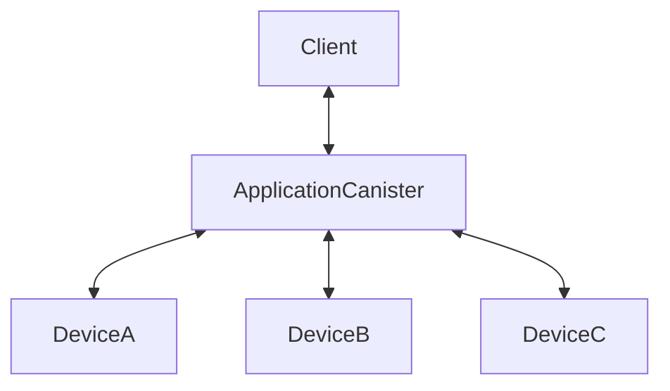

<div align="center">
	

# Harness


</div>

This framework allows for an IC canister to be piggybacked on IoT devices for:

- additional compute off-chain where reasonable or just
- to provide a bridge between the IoT device and the IC.

🚧 No security is done in any part of the project. Still in PoC state.

## Release notes

Release notes and unreleased changes can be found in the [CHANGELOG](./CHANGELOG.md).

## Quick Start

### Prerequisites

1. Rust toolchain. You can install it using [rustup](https://rustup.rs/). To compile the application.
2. The [dfx tool](https://internetcomputer.org/docs/current/developer-docs/getting-started/install/#installing-dfx-via-dfxvm). To create a local network and deploy the canister.
3. Ngrok. To allow your harness node to be accessible on the public internet. You can get started [here](https://ngrok.com/download).

### Setting up our Hello Example

This sample code can be found [here](./examples/hello/).

This is the whole application:

```rust
use candid::{Decode, Encode};
use harness_cdk::prelude::*;

#[harness]
fn hello(msg: String) -> String {
    format!("Hello, {msg}!")
}

harness_export!();
```

There is no cli tool yet and none is planned atm. You can use the following script to build your canister, [here](./examples/hello/build.sh)
We run the build script:

```sh
chmod +x ./build.sh #This should allow the script to be executable
./build.sh
```

The next step will be to start our node, in another tab:

```sh
cd harness-node
HARNESS_PORT='8080' cargo run 
```

Now we can server our harness node to the public internet using ngrok:

```sh
ngrok http 8080
```

### Interacting with the Harness System

Now that everything is set up, we can start interacting with our system.

1. First we can check the health of our system:

    ```sh
    curl http://localhost:8080/hello
    ```

2. We can then register our harness node to the canister:

    ```sh
    dfx canister call <canister_id> register_device '("http://<ngrok-url>")'
    ```

3. Next we need to pull the harness code from the canister for our server to load.

    ```sh
    curl --header "Content-Type: application/json" \
     --request POST \
     --data '{"canister_id":"<canister_id>","program_id":"hello","url":"<icp_replica_url>"}' \
      http://localhost:8080/program
    ```

4. Finally we can call out canister, which will arbiter the call to the harness node.

    ```sh
    dfx canister call <canister_id> hello '("World")'
    ```

## Structure of the System


